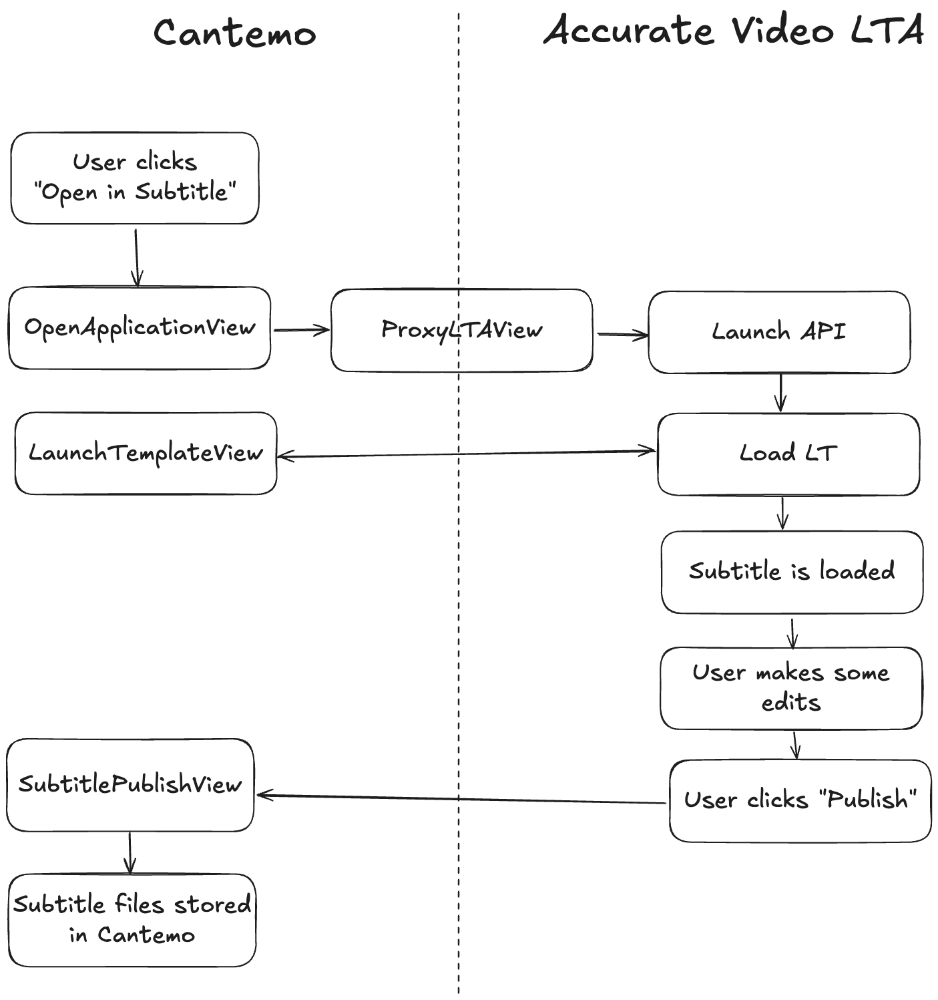

# AV LTA Plugin

This plugin is an _example_ on how to integrate Accurate Video (AV) using its Launch Template Architecture (LTA), see https://apps.accurate.video/. The plugin currently integrates AV Subtitle, but could be extended to open other applications as well using the same patterns. See this plugin as starting point on how you can use AV LTA with Cantemo, build on this as you see fit, change the parts that don't fit your needs, extend it with what you need for your use-case.

From a user perspective, the plugin adds an _"Open in Subtitle"_ action to the _Item page_, _Search page_, and _Media Bin_. This action opens AV Subtitle in a new tab, where you can make edits to any subtitle files present on the selected items. The edits are finalized by using the _"Publish"_ button in AV Subtitle, this saves the subtitle file as a new Shape on the Item where it originated from. This means you'll find the new Shape in the _"Formats"_-tab on the Item page.

Settings for the plugin can be found on the _"System" > "System Settings"_ page. Look for _"Accurate Video LTA"_ in the menu on the left hand side. Here you'll find settings to control what LTA deployment to use for example.

The plugin adds the role _"Subtitle"_ (`av_lta_role_subtitle`) (under _"AV LTA Roles"_). You'll need to assign this role to the users/groups that should have the "Open in Subtitle" action.

## Installation

1. Download and install
    ```sh
    curl -L https://github.com/Cantemo/AVLTAPlugin/archive/main.zip > AVLTAPlugin-main.zip
    unzip AVLTAPlugin-main.zip
    mv AVLTAPlugin-main/av_lta /opt/cantemo/portal/portal/plugins/
    chown -R www-data:www-data /opt/cantemo/portal/portal/plugins/av_lta
    sudo service portal-web restart
    ```
2. Run database migrations
   ```sh
   /opt/cantemo/portal/manage.py migrate av_lta
   ```
3. Activate the plugin by opening admin page in Cantemo. The plugin is listed there as _"Accurate Video LTA Plugin"_. Activate it.
4. Restart Cantemo
   ```sh
   sudo service portal-web restart
   ```
5. Assign the role _"AV LTA Roles" > "Subtitle"_ to the users/groups that should have access.

## Development

This project uses [uv](https://docs.astral.sh/uv/) as the package and project manager.

To install dev environment packages (in the project root):

```sh
uv sync
```

### Run lint

```
uv run pre-commit run --all-files
```

Optional: Install as pre-commit hooks
```
uv run pre-commit install
```

### Run unit tests

```
/opt/cantemo/portal/manage.py test portal.plugins.av_lta --keepdb
```

The `--keepdb` flag is optional, but it speeds up running the tests as the test database does not need to be re-created each time.

### Run type checking

```
uv run mypy --no-namespace-packages -p av_lta
```


### "Open in Subtitle" Overview



The "Open in Subtitle" action opens the `OpenApplicationView` (example: `/av_lta/open?application=subtitle&item_ids=VX-1,VX-2`).

This view redirects to the [LTA Launch API](https://apps.accurate.video/docs/subtitle/reference/launch-api) (example: `/av_lta/apps/launch/subtitle/?launchTemplate=/av_lta/get_launch_template?item_ids=VX-1,VX-2`). The AV apps are proxied (by default from https://apps.accurate.video/) on this url by the `ProxyLTAView` in order to serve the frontend on the same domain as Cantemo. This makes it possible to retain the authentication already done by Cantemo in the AV application, as they are now served from the same domain.

The AV application requests the Launch Template from the `LaunchTemplateView` (example: `/av_lta/get_launch_template?item_ids=VX-1,VX-2`). The view fetches the items from Cantemo and transforms the data to a [Launch Template (LT)](https://apps.accurate.video/docs/subtitle/reference/launch-template-format) JSON and returns it. You'll find most of the transform code in `transform.py`.

AV Subtitle loads the LT and the application starts. The user makes their edits, and when they are ready the _"Publish"_ button is used. This triggers the configured [publish](https://apps.accurate.video/docs/subtitle/reference/launch-template-format#publish) endpoint to be called.

The LT in this case is configured to call the `SubtitlePublishView` (example: `/av_lta/publish?itemIds=VX-1&fileId=VX-3_VX-4`). The view finds the Item that the subtitle originated from and stores the updated file contents as a new Shape on the same Item. If you want to change how the results are stored back to Cantemo, this is where you would do that.

### Add more settings

Plugin settings are handled by the `PluginSettings` object in `settings.py`. It loads settings in this order: database > django > environment variables > default values. Default values are defined on the `PluginSettings` class. To expose settings on the admin page, you update the `SettingsForm` with the new setting defined on `PluginSettings`. To use any the plugin settings:

```python
# Import
from .settings import plugin_settings

# Example usage
plugin_settings.AV_LTA_PUBLISH_SHAPE_TAG
```
